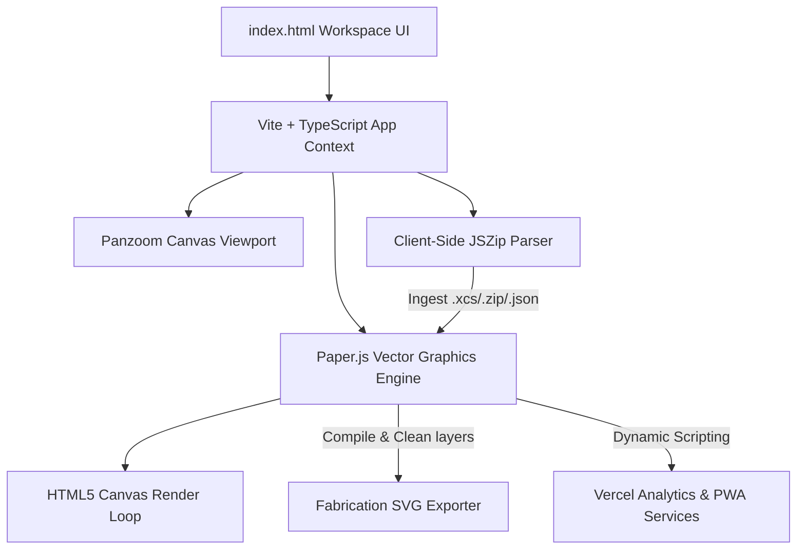
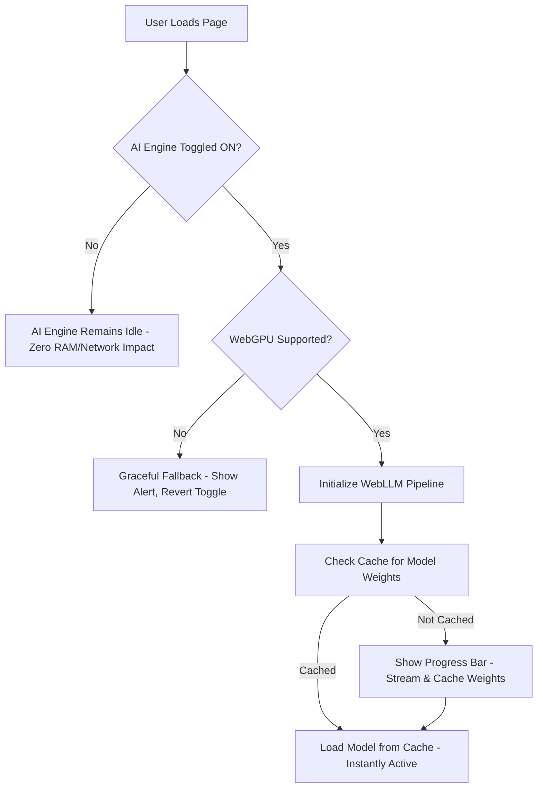

# 🌌 VECTRONOMY: MASTER PLAN, ROADMAP & DOCUMENTATION LIBRARY
### 📋 Professional 100-Feature Industrial CAD Upgrade Blueprint

This document represents the master architectural plan and exhaustive feature roadmap for **VECTRONOMY**. It maps out **100 key features, tools, and technical upgrades** designed to elevate VECTRONOMY from a high-fidelity editor into an industry-leading competitor to **Adobe Illustrator**, **LightBurn**, and **xTool Creative Space (XCS)**.

---

## 🏗️ SYSTEM ARCHITECTURE OVERVIEW

VECTRONOMY leverages an ultra-high performance client-side tech stack designed for sub-millisecond drawing cycles and complex mathematical rendering:



---

## 📑 COMPREHENSIVE ROADMAP (100 FEATURES & TOOLS)

---

### 📐 Division 1: Vector Drawing & Geometry Creation (Illustrator-Grade)

These tools provide the foundational drawing controls necessary to draft clean, mathematically precise vector shapes.

1.  **Pen Tool (Bezier Plotting)**
    *   *Technical Integration*: Implement custom click-and-drag listener states updating Paper.js `Path` and `Segment` handles in real-time.
    *   *Market Value*: Provides core illustrator capability to trace and compose bespoke, custom-tailored curves.
2.  **Parametric Rectangle Tool**
    *   *Technical Integration*: Utilize `Path.Rectangle` paired with holding down `Shift` constraints to lock 1:1 aspect ratio squares.
    *   *Market Value*: Fundamental shape creation, perfect for backing sheets and mounting frames.
3.  **Proportional Circle & Ellipse Tool**
    *   *Technical Integration*: Utilize `Path.Circle` or `Path.Ellipse` linked with cursor vectors for immediate geometric sizing.
    *   *Market Value*: Key drafting tool for pins, gears, axles, and circular backing plates.
4.  **Regular Polygon Tool**
    *   *Technical Integration*: Utilize `Path.RegularPolygon` with dynamic number of sides inputted from the properties panel.
    *   *Market Value*: Instantly creates triangles, hexagons, and octagons for hardware mounts and decorative frames.
5.  **Two-Radius Star Generator**
    *   *Technical Integration*: Custom math routine generating vertices looping alternating inner and outer radius coordinates.
    *   *Market Value*: Creates custom award plaques, seals, and artistic design elements.
6.  **Logarithmic Spiral Drafting Tool**
    *   *Technical Integration*: Draw lines based on Polar coordinate math: $r = a e^{b \theta}$.
    *   *Market Value*: Essential for specialized CNC coil shapes, springs, and ornate engraving details.
7.  **Freehand Pencil Tool (Curve Fitting)**
    *   *Technical Integration*: Record cursor drag array coordinates and run the Paper.js `path.simplify()` routine to fit clean bezier paths.
    *   *Market Value*: Allows fluid, organic sketching directly with drawing tablets or mice.
8.  **Line Segment Tool (Angle Constraints)**
    *   *Technical Integration*: Create basic linear paths with Shift key bindings locking slope constraints to $0^\circ, 45^\circ,$ and $90^\circ$.
    *   *Market Value*: Essential for construction lines and grid structures.
9.  **Multi-segment Polyline Tool**
    *   *Technical Integration*: Persistent line instantiator that adds successive segments with each click and closes only upon hitting Enter/Esc.
    *   *Market Value*: Speeds up structural architectural floor layouts and trace paths.
10. **Industrial Step-and-Repeat Array Generator**
    *   *Technical Integration*: Clone selected elements along mathematical matrices ($X \times Y$) with user-defined row and column spacing.
    *   *Market Value*: Maximizes material yield during high-volume fabrication runs (e.g. cutting 50 copies of a keychain).

---

### 🎛️ Division 2: Bezier & Node Manipulation Engine

To modify existing paths with micro-precision down to individual bezier control points.

11. **Interactive Anchor Point Selector**
    *   *Technical Integration*: Render clickable circular handles at path vertex locations; clicking captures the node index.
    *   *Market Value*: Lets users refine imported vector layouts at the absolute structural level.
12. **Asymmetric/Smooth Handles Controller**
    *   *Technical Integration*: Adjust `segment.handleIn` and `segment.handleOut` vectors dynamically on cursor drag.
    *   *Market Value*: Standard CAD handle behavior that allows creating smooth, flowing curves.
13. **Node Corner-Convert (Handle Splitter)**
    *   *Technical Integration*: Toggle `segment.linear` properties or mathematically split handles to break their straight-line link.
    *   *Market Value*: Instantly converts a smooth wave peak into a sharp, pointed crest.
14. **Direct Handle Snapping**
    *   *Technical Integration*: Force handle vectors to snap to vertical ($90^\circ$) and horizontal ($0^\circ$) axes when within a $5^\circ$ threshold.
    *   *Market Value*: Essential for creating perfectly symmetrical organic curves.
15. **Inline Anchor Insertion Tool**
    *   *Technical Integration*: Capture path location parameters on click and call `path.divideAt(offset)` or insert a node without changing the shape curve.
    *   *Market Value*: Allows adding detail to a specific section of an existing shape without rebuilding it.
16. **Structural Anchor Node Deletion**
    *   *Technical Integration*: Delete selected segment indices and mathematically recalculate the surrounding curve segments to seal the path.
    *   *Market Value*: Cleans up and simplifies over-complicated vector geometries.
17. **Node Align Tool (Matrix Alignment)**
    *   *Technical Integration*: Force selected anchor coordinates ($x$ or $y$) to match a specific line or bounding boundary.
    *   *Market Value*: Standard tool for drafting perfectly straight edges inside complex hand-drawn paths.
18. **Segment Scissors (Scissors Tool)**
    *   *Technical Integration*: Cut an active path segment at a clicked coordinates, creating two distinct open endpoints.
    *   *Market Value*: Crucial for editing intricate nested outlines.
19. **Open Endpoint Joining**
    *   *Technical Integration*: Detect close open endpoints ($d < 5\text{ px}$) and merge them into a single continuous path segment.
    *   *Market Value*: Heals broken or poorly exported CAD vectors before fabrication.
20. **Close Path Toggle**
    *   *Technical Integration*: Draw a closing line between the start and end nodes of an open path.
    *   *Market Value*: Instantly prepares raw outlines for solid filling or pocket milling operations.

---

### 🧮 Division 3: Boolean Operations & Path Mathematics

The mathematical logic core to perform complex constructive area geometry.

21. **Unite (Boolean Union)**
    *   *Technical Integration*: Call the native Paper.js `path.unite(otherPath)` method on selected paths.
    *   *Market Value*: Melds overlapping vectors (like script lettering) into a single cohesive cut profile.
22. **Subtract (Boolean Difference)**
    *   *Technical Integration*: Call Paper.js `path.subtract(otherPath)` to subtract the top item from the bottom.
    *   *Market Value*: Creates custom holes, cutouts, and slots inside panels.
23. **Intersect (Boolean Intersection)**
    *   *Technical Integration*: Call Paper.js `path.intersect(otherPath)`.
    *   *Market Value*: Retains only overlapping areas, perfect for masking patterns into boundaries.
24. **Exclude (Boolean XOR)**
    *   *Technical Integration*: Call Paper.js `path.exclude(otherPath)`.
    *   *Market Value*: Instantly creates hollow frames or transparent stencil layouts.
25. **Divide (Path Flattening)**
    *   *Technical Integration*: Run area intersection sweeps, splitting all overlapping paths at their intersection boundaries.
    *   *Market Value*: Necessary for mosaic crafting and complex multi-layered color work.
26. **Stroke-to-Path Converter (Outline Stroke)**
    *   *Technical Integration*: Calculate outline boundaries based on stroke width, cap, and join settings to generate a closed compound path.
    *   *Market Value*: Crucial for laser engraving outlines: lasers follow lines, so a thick stroke must be converted to a shape to cut the outline.
27. **Contour Offset Engine (Kerf & Expansion)**
    *   *Technical Integration*: Implement offsetting algorithms to draw expanded/contracted outer paths.
    *   *Market Value*: Core to making offsets, thick borders, and laser cut boundaries.
28. **Douglas-Peucker Simplification Solver**
    *   *Technical Integration*: Use native `path.simplify(tolerance)` to reduce node weight based on curve delta calculations.
    *   *Market Value*: Reduces G-code file sizes and prevents machinery jitter.
29. **Bezier Flattening (Curve-to-Line)**
    *   *Technical Integration*: Convert bezier curves into fine-resolution straight line segments (`path.flatten(maxDistance)`).
    *   *Market Value*: Essential compatibility patch for older CNC machines that do not interpret standard bezier arcs.
30. **Path Direction Reversal**
    *   *Technical Integration*: Reverse the node sequence index (`path.reverse()`) to invert clockwise/counter-clockwise winding.
    *   *Market Value*: Critical for G-code pocket generators to determine inner vs outer boundaries correctly.

---

### 🔌 Division 4: Laser Cutting & Engraving Parameters (LightBurn/XCS-Grade)

Specific settings designed to optimize project outcomes for laser cutters (CO2, Diode, and Fiber).

31. **Friction-Fit Kerf Compensator**
    *   *Technical Integration*: Run automated offset paths (outwards for cuts, inwards for holes) matching laser beam width ($0.08 - 0.2\text{ mm}$).
    *   *Market Value*: Enables precise wood and acrylic puzzles, boxes, and interlocking mechanical joints.
32. **Burn-Preventing Lead-in / Lead-out**
    *   *Technical Integration*: Inject a tiny straight or curved lead-in line at the start of a cut path, shifting the initial pierce mark outside the final design.
    *   *Market Value*: Avoids puncture burn marks on premium woods and metals.
33. **Micro-Joint Tab Placer**
    *   *Technical Integration*: Automatically split a path, inserting tiny un-cut gaps ($0.2 - 0.8\text{ mm}$) along the border.
    *   *Market Value*: Keeps small parts from falling through honeycomb beds or shifting mid-cut.
34. **Inner-First Cut Sorter**
    *   *Technical Integration*: Perform area overlap containment checks; assign higher cutting priorities to fully enclosed nested shapes.
    *   *Market Value*: Guarantees nested detail parts are cut *before* the outer outline detaches the stock from the sheet.
35. **TSP (Traveling Salesperson) Router**
    *   *Technical Integration*: Implement a fast nearest-neighbor or 2-opt search heuristic to minimize travel distance between independent cuts.
    *   *Market Value*: Saves up to 40% of laser operational times by optimizing head transit paths.
36. **Acrylic Overcut Compensator**
    *   *Technical Integration*: Extend the laser cut trajectory $X\text{ mm}$ past the closing node to guarantee full penetration.
    *   *Market Value*: Prevents thick materials from snagging at start/stop points.
37. **Color-Operational Mapping**
    *   *Technical Integration*: Bind stroke/fill hex codes to laser command modes (Cut, Score, Raster Engrave).
    *   *Market Value*: Seamless standard laser operation workflow directly from design files.
38. **Thermal Power Ramping**
    *   *Technical Integration*: Dynamically ramp laser power up at acceleration and down during deceleration corners.
    *   *Market Value*: Prevents excessive charring on corners and sharp bends.
39. **Dashed Perforation Generator**
    *   *Technical Integration*: Convert standard lines into segmented cut-and-gap sequences based on user ratios.
    *   *Market Value*: Perfect for designing folding cardboard, sheet metal bends, and custom tear-away tickets.
40. **Multi-Pass Depth Controller**
    *   *Technical Integration*: Parameterize SVG export to output multiple identical passes for specific vector layers.
    *   *Market Value*: Enables deep cutting in hard woods without charring, by running multiple shallow passes.

---

### ⚙️ Division 5: CNC, Milling, & Router Specific Settings

Advanced parameter configurations tailored for computer-numerical-control milling machinery.

41. **CNC Bit Offset Compensator**
    *   *Technical Integration*: Offset G-code paths by the router bit radius to maintain dimensional accuracy.
    *   *Market Value*: Crucial for mechanical structural assemblies milled on wood or aluminum CNC routers.
42. **Pocket Hatch Generator**
    *   *Technical Integration*: Compute offset contours and linear fill patterns to empty interior pockets down to a specific depth.
    *   *Market Value*: Essential for milling signs, carving cavities, and machining mechanical parts.
43. **3D Chamfering & V-Groove Calculator**
    *   *Technical Integration*: Calculate progressive depth coordinates based on bit angle for sloped edges.
    *   *Market Value*: Produces professional beveled borders on wood projects.
44. **Drilling / Boring Operations Handler**
    *   *Technical Integration*: Scan for circular paths; replace coordinate loops with simple vertical Z-axis drilling drops.
    *   *Market Value*: Dramatically speeds up G-code parsing for mounting plate screw holes.
45. **V-Carving Path Solver**
    *   *Technical Integration*: Calculate variable depth (Z-height) based on the distance between dual border vectors for a angled V-bit.
    *   *Market Value*: Enables beautiful, traditional 3D chiseled wood signs and lettering.
46. **Milling Holding Tabs**
    *   *Technical Integration*: Generate thick physical connection tabs to keep wood and metal stock firmly attached to the frame.
    *   *Market Value*: Standard safety safety requirement for high-vibration CNC setups.
47. **Feed and Plunge Rate Ingress**
    *   *Technical Integration*: Map XY cutting speeds (Feed Rate) and Z entry speeds (Plunge Rate) directly to SVG metadata tags.
    *   *Market Value*: Eliminates manual speed overrides inside CNC controller software.
48. **Raster Concentric Hatching**
    *   *Technical Integration*: Generate spiraling concentric offset contours inside shapes to machine pockets smoothly.
    *   *Market Value*: Reduces wood tearing and prolongs router bit life.
49. **Stepover Overlap Configurator**
    *   *Technical Integration*: Parameterize the cutter step distance overlap (usually 40% - 80% of tool width) for surface sweeps.
    *   *Market Value*: Allows balancing speed against final surface finish smoothness.
50. **Safe Retract Z-Height Guard**
    *   *Technical Integration*: Configure a clear retraction height for travel transit movements.
    *   *Market Value*: Ensures the spindle tool retracts high enough to clear uneven boards or clamps.

---

### 🎯 Division 6: CAD Precision, Rulers, & Snapping Tools

Interface overlays and math utilities to establish perfect dimensional accuracy in the workspace.

51. **Dynamic Layout Rulers**
    *   *Technical Integration*: Render responsive SVG/Canvas ruler coordinates with tracking guidelines tied to cursor movement.
    *   *Market Value*: Standard visual layout standard for engineers and woodworkers.
52. **Drag-and-Drop Guidelines**
    *   *Technical Integration*: Pull horizontal or vertical guide corridors directly out from the rulers and place them on the canvas.
    *   *Market Value*: Aids in aligning text, borders, and margins across complex layouts.
53. **Grid Subdivisions Manager**
    *   *Technical Integration*: Draw coordinate grids featuring major/minor subdivisions, toggleable between Metric and Imperial.
    *   *Market Value*: Speeds up design layout calculations.
54. **Snap to Grid**
    *   *Technical Integration*: Round coordinate inputs to the nearest active grid intersection value.
    *   *Market Value*: Accelerates drafting by ensuring shapes lock to exact dimensions.
55. **Snap to Paths & Tangents**
    *   *Technical Integration*: Query vector paths to detect nearest edge intersections, corners, or tangents within a pixel threshold.
    *   *Market Value*: Essential for placing new parts exactly touching or centered on existing lines.
56. **Centroid Alignment Tracker**
    *   *Technical Integration*: Calculate path geometric centers and display vertical/horizontal alignment guides when aligning centroids.
    *   *Market Value*: Standard tool for clean, centered typographic and vector layouts.
57. **High-Precision Numerical Inspector**
    *   *Technical Integration*: High-fidelity side inputs showing absolute properties: X, Y, Width, Height, and Rotation.
    *   *Market Value*: Lets professional designers key in exact sizes down to thousands of a millimeter.
58. **Relative/Incremental Move Tool**
    *   *Technical Integration*: Input values to move an element relative to its current coordinate position.
    *   *Market Value*: Simplifies repetitive alignment offsets.
59. **Precision Keyboard Nudges**
    *   *Technical Integration*: Bind Arrow keys to adjust selected coordinates by customizable increments (e.g. $0.1\text{ mm}$ or $1\text{ mm}$).
    *   *Market Value*: Speeds up micro-position adjustments.
60. **Canvas Pivot-Point Tool**
    *   *Technical Integration*: Allow moving the origin coordinates of rotation, scaling, and shear actions to any point.
    *   *Market Value*: Essential for complex rotative alignments (e.g. arranging spokes around a wheel).

---

### 📸 Division 7: Image Ingestion, Vectorization, & Tracing Engine

For importing and converting physical hand-drawn artwork, photos, or logos into crisp paths.

61. **Image Drop Target Handler**
    *   *Technical Integration*: Drag-and-drop file listener that reads image files as Data URLs and renders them inside the canvas layer.
    *   *Market Value*: Convenient workflow entry point for starting projects with physical artwork.
62. **Client-Side Image Auto-Tracing (Potrace)**
    *   *Technical Integration*: Process image pixels into a binary matrix and trace contours to create smooth bezier coordinates.
    *   *Market Value*: Standard feature in Illustrator and LightBurn, saving users from manually tracing logos.
63. **Interactive Threshold Slider**
    *   *Technical Integration*: Canvas threshold filter to preview black-and-white vector limits before executing trace.
    *   *Market Value*: Lets users adjust contrast to capture fine lines from pencil sketches.
64. **Color Isolation Tracing**
    *   *Technical Integration*: Group image pixels by color similarity and trace each group to a separate layer.
    *   *Market Value*: Converts multi-colored logos into clean, color-separated layers for cutting.
65. **Noise Reduction Speckle Filter**
    *   *Technical Integration*: Filter out pixel clusters smaller than a configured size threshold during binarization.
    *   *Market Value*: Cleans up dirty, grainy scans automatically.
66. **Smoothness Corner Thresholding**
    *   *Technical Integration*: Parameterize the tracing curve-fitting tolerance to adjust corner sharpness.
    *   *Market Value*: Retains organic hand-drawn details or outputs clean, sharp modern lines.
67. **Centerline Tracing Engine**
    *   *Technical Integration*: Trace the thin centerlines of drawings, outputting single strokes instead of thick outline blocks.
    *   *Market Value*: Essential for engraving handwritten signatures, signatures, or clean sketch outlines.
68. **Background Chroma-Key & Alpha Eraser**
    *   *Technical Integration*: Flood-fill alpha thresholding to clear background colors before vectorization.
    *   *Market Value*: Saves time spent prepping logos in external photo editors.
69. **Raster Halftoning Engraver**
    *   *Technical Integration*: Convert grayscale image pixels into array patterns of dots of varying sizes.
    *   *Market Value*: Enables engraving photographic portraits directly onto slate, wood, or acrylic.
70. **Contrast pre-filters**
    *   *Technical Integration*: Pixel-level shaders to adjust brightness and contrast before running the vectorizer.
    *   *Market Value*: Maximizes trace clarity from poor, low-light cell phone photos.

---

### 🔠 Division 8: Text, Typography, & Layout Utilities

Advanced text tools to design layouts directly on the canvas without converting elsewhere.

71. **Multi-font Typography Engine**
    *   *Technical Integration*: Native font rendering systems inside the Canvas; load and display font families cleanly.
    *   *Market Value*: Essential for custom signage, personalized wedding plates, and plaque designs.
72. **Convert Text to Path (Outlining)**
    *   *Technical Integration*: Call `path.outlines()` or load `.ttf` geometries to convert text strings to standard bezier lines.
    *   *Market Value*: Translates typographic text into cut-ready physical vector outlines.
73. **Text Kerning & Tracking Adjuster**
    *   *Technical Integration*: Granular spacing control between individual characters and lines.
    *   *Market Value*: Critical for dialing in clean typographic logo designs.
74. **Paragraph Alignment Controls**
    *   *Technical Integration*: Support for standard alignment anchors: Left, Right, Center, and Justified.
    *   *Market Value*: Simplifies complex product specifications blocks or name plaques.
75. **Drag-and-Drop Font Loader**
    *   *Technical Integration*: Load custom TrueType (`.ttf`) and OpenType (`.otf`) files via drag-and-drop.
    *   *Market Value*: Lets users use proprietary branding fonts directly without installing them on the system.
76. **Circular Path Warp**
    *   *Technical Integration*: Calculate text position offsets along circular circumference lines.
    *   *Market Value*: Standard tool for designing circular logos and seals.
77. **Text Along Arbitrary Curves**
    *   *Technical Integration*: Map text character baselines to the points along an arbitrary bezier curve.
    *   *Market Value*: Enables wave-like, flowing decorative typographic designs.
88. **Vertical Typographic Mode**
    *   *Technical Integration*: Arrange text layout grids vertically.
    *   *Market Value*: Essential for traditional East Asian vertical sign engraving.
79. **Stencil Bridge Injector**
    *   *Technical Integration*: Automatically detect closed loops inside letters (like O, A, D, B, P) and slice connection gaps into them.
    *   *Market Value*: Prevents interior letter centers from falling out when cutting sheet stencils.
80. **Variable Serialization Tracker**
    *   *Technical Integration*: Automated variables (e.g. `{date}`, `{serial}`) that update dynamically.
    *   *Market Value*: Essential for manufacturing serial number tags and industrial labels.

---

### 🌳 Division 9: Layer Tree, Hierarchy, & Asset Management

For maintaining full design organization inside highly complex drawings.

81. **Nested Layer Tree Panel**
    *   *Technical Integration*: Build a collapsible list panel displaying layers, subgroups, and paths.
    *   *Market Value*: Lets users manage hundreds of paths on highly complex vector templates.
82. **Layer Lock Toggle**
    *   *Technical Integration*: Toggle non-interactive states on elements to prevent accidental selections.
    *   *Market Value*: Saves time by locking background borders so you can edit interior details safely.
83. **Color-Coded Layers**
    *   *Technical Integration*: Assign distinct sidebar highlight colors to different layers, matching their canvas outlines.
    *   *Market Value*: Standard workspace layout organization found in Illustrator and AutoCAD.
84. **Group / Ungroup**
    *   *Technical Integration*: Create Paper.js `Group` structures, moving children collectively as one entity.
    *   *Market Value*: Keeps compound parts together during complex layout changes.
85. **Depth Reordering (Z-Index)**
    *   *Technical Integration*: Shift elements forward or backward within their layer folder.
    *   *Market Value*: Essential for overlapping vector shapes and solid-fill layouts.
86. **Layer Merging**
    *   *Technical Integration*: Collapse selected layers together into a single layer folder.
    *   *Market Value*: Cleans up workspace organization before exporting.
87. **Group Isolation Mode**
    *   *Technical Integration*: Double-click a group to focus strictly on editing its contents, locking all other elements.
    *   *Market Value*: Standard tool for editing complex assemblies without disrupting outer elements.
88. **Asset Symbols Library**
    *   *Technical Integration*: Instantiate reusable template shapes (Symbols) linked to a master parent element.
    *   *Market Value*: Updating a single master parent shape instantly updates all cloned symbols across the design.
89. **Selection Batch Exporter**
    *   *Technical Integration*: Select specific elements and export them directly to separate files.
    *   *Market Value*: Saves time spent manually separating parts into multiple files.
90. **Import Hierarchy Preservation**
    *   *Technical Integration*: Parse imported SVG groups and retain original layers and nested folders.
    *   *Market Value*: Ensures vector organization is preserved when transferring designs between platforms.

---

### 💻 Division 10: App Architecture, PWA, Cloud, & Performance Polish

To establish an industrial-grade workspace environment that runs at peak performance.

91. **High-Performance Memoized UI (Memoization)**
    *   *Technical Integration*: Optimize cursor handle updates to avoid DOM rendering bottlenecking during real-time movement.
    *   *Market Value*: Delivers a smooth, high-frame-rate canvas experience even with complex designs.
92. **Installable PWA Offline Support**
    *   *Technical Integration*: Implement custom service workers and manifest files for local caching.
    *   *Market Value*: Allows fabricators to run the editor offline directly in workshop computers without internet.
93. **Web Worker Math Offloading**
    *   *Technical Integration*: Offload CPU-heavy calculations (Boolean math, Potrace tracing, TSP path routing) to Web Workers.
    *   *Market Value*: Keeps the UI fluid and responsive even during heavy background operations.
94. **Automated IndexedDB Session Auto-Save**
    *   *Technical Integration*: Silently back up the current workspace state to IndexedDB every 30 seconds.
    *   *Market Value*: Saves hours of work from sudden power cuts, battery drain, or tab crashes.
95. **G-Code Cutting Simulator**
    *   *Technical Integration*: Render a simulated laser head showing the exact path the laser nozzle or milling bit will take.
    *   *Market Value*: Prevents mistakes by letting users review the cutting process before running the machine.
96. **Vercel Telemetry Integration**
    *   *Technical Integration*: Dynamic, warning-free script injection to log user analytics.
    *   *Market Value*: Provides anonymous usage metrics to help optimize the application.
97. **SVG Live Code Synchronization**
    *   *Technical Integration*: Synced code panel displaying live, updating XML code alongside the canvas.
    *   *Market Value*: Ideal for developers who want to copy clean SVG code directly from their edits.
98. **Custom Hotkey Configurator**
    *   *Technical Integration*: Custom shortcut-binding panel mapping keyboard triggers.
    *   *Market Value*: Lets users map keyboard shortcuts to match their favorite software (e.g. Illustrator or AutoCAD).
99. **Cloud Sync Template Library**
    *   *Technical Integration*: Secure authentication system to back up vector templates in the cloud.
    *   *Market Value*: Allows users to sync their custom design library across multiple workshop machines.
100. **High-DPI Retina Rendering**
    *   *Technical Integration*: Dynamic pixel ratio canvas scaling.
    *   *Market Value*: Guarantees crisp, sharp vector lines on premium high-density 4K displays.

---

## 🧠 DIVISION 11: ARTIFICIAL INTELLIGENCE & IN-BROWSER INFERENCE ENGINE

### 🔬 Technical Research Study: In-Browser WebGPU LLMs

To make VECTRONOMY a state-of-the-art, future-proof CAD tool, we can embed a **local, 100% private, hardware-accelerated LLM engine** directly inside the browser using **WebGPU** via the **WebLLM** library (developed by the MLC-LLM ecosystem). 

#### 1. Core Technology: WebGPU & WebLLM
*   **WebGPU API**: WebGPU is the modern successor to WebGL, offering low-latency, direct GPU compute execution inside the browser. It allows web applications to run local machine learning models at near-native speeds.
*   **WebLLM Library**: A high-performance, WebGPU-accelerated in-browser LLM engine. It runs quantized LLM models locally without sending any data to external servers, ensuring absolute privacy for proprietary industrial designs.

#### 2. Optimized Model Selection & VRAM Footprint
While 9B+ parameter models are highly capable, executing them in-browser requires up to 6GB+ of VRAM, which will crash standard consumer laptops and tablets. For optimal browser performance, we recommend offering a **Multi-Tier Model Selector**:

| Model Name | Param Count | Quantization | Size on Disk | Min VRAM | Best Use Case |
| :--- | :--- | :--- | :--- | :--- | :--- |
| **Qwen-2.5-1.5B-Instruct** | 1.5 Billion | 4-bit (q4f16_1) | ~1.1 GB | ~1.5 GB | Ultra-fast low-end device drafting, G-code scripts |
| **Gemma-2-2B-it** | 2.0 Billion | 4-bit (q4f16_1) | ~1.4 GB | ~2.0 GB | Standard default for CAD Prompts & Parametric Layouts |
| **Phi-3.5-mini-Instruct** | 3.8 Billion | 4-bit (q4f16_1) | ~2.2 GB | ~3.0 GB | High-fidelity reasoning, complex Boolean path math |
| **Llama-3.1-8B-Instruct** | 8.0 Billion | 4-bit (q4f16_1) | ~4.5 GB | ~6.0 GB | Premium workstations (RTX 4090/3080) for advanced design |

---

### 🕹️ Toggleable UI Control Strategy & Lifecycle

To ensure VECTRONOMY remains lightning-fast and accessible to users with low-end computers or incompatible browsers, the AI Engine must follow a **Strict Opt-In, Toggleable Lifecycle**:



#### Toggle Implementation (HTML/CSS/JS)
```html
<div class="ai-control-panel glass">
  <div class="panel-row">
    <span>💻 Local WebGPU Inference Model (WebGPU)</span>
    <label class="switch">
      <input type="checkbox" id="ai-toggle">
      <span class="slider round"></span>
    </label>
  </div>
  <div id="ai-status-panel" hidden>
    <div class="status-indicator"><span class="dot blinking"></span> Loading WebGPU engine...</div>
    <div class="progress-bar"><div id="ai-progress-fill" style="width: 0%"></div></div>
  </div>
</div>
```

---

### 🚀 10 AI-Powered Features & Tools

101. **Natural Language Text-to-CAD (Prompt-to-Vector)**
     *   *Technical Integration*: Ingest user prompts ("draw a star with 8 points and a radius of 50mm") inside the panel. WebLLM processes the prompt and outputs structured Paper.js drawing command calls, rendering the geometry on the canvas instantly.
     *   *Market Value*: Demolishes the CAD learning curve, letting beginners draft precision parts using plain language.
102. **Semantic SVG Parser & Group Healer**
     *   *Technical Integration*: Pass raw SVG coordinates to the model. Prompt the AI to identify topological design errors (unclosed lines, intersecting cut borders) and generate healed vector nodes.
     *   *Market Value*: Saves users from manually tracing and fixing dirty, broken imported vector drawings.
103. **Automatic Cutting Parameter Recommender**
     *   *Technical Integration*: Parse inputs ("cutting 5mm Walnut on a 40W CO2 laser") against the model's knowledge base. Output precise, recommended speed, power, and passes.
     *   *Market Value*: Eliminates the trial-and-error scrap wood testing process for makers.
104. **Intelligent Element Grouper & Classifier**
     *   *Technical Integration*: Feed path coordinates to the LLM; ask it to identify structural parts (e.g. "This circle array is a mounting hole grid, this rectangle is the plate"). Instantly generate logical layers.
     *   *Market Value*: Converts raw, messy imported vector files into organized CAD folders.
105. **AI-Assisted Nesting Optimizer**
     *   *Technical Integration*: Feed the coordinates of multiple vector elements to the model; prompt it to output optimal rotation and coordinate mapping layout suggestions.
     *   *Market Value*: Saves money by packing multiple parts as tightly as possible on expensive materials.
106. **Text-to-Stencil Bridge Autopatcher**
     *   *Technical Integration*: Analyze letter shapes and have the AI determine coordinates to inject gaps/bridges in closed letter centers (O, P, D, etc.).
     *   *Market Value*: Instantly prepares high-precision, robust stencils that don't fall apart.
107. **Joint Kerf Auto-Optimizer**
     *   *Technical Integration*: Identify interlocking joints (like box finger joints) and calculate exact offset adjustments based on material type (wood, acrylic, steel).
     *   *Market Value*: Ensures all sliding joints fit together snug and secure without glue.
108. **Engraving Dithering Advisor**
     *   *Technical Integration*: Analyze imported image texture and material selection, recommending the ideal halftoning algorithm (e.g. Floyd-Steinberg dither vs Concentric circle halftoning).
     *   *Market Value*: Produces studio-grade photographic engravings on complex grains.
109. **Predictive Corner-Burn Prevention**
     *   *Technical Integration*: Predict deceleration curves on sharp vector corners and dynamically insert power reduction overrides into G-code blocks.
     *   *Market Value*: Prevents unsightly charred corners on wood and melted edges on acrylic.
110. **Natural Language CAD Scripting REPL Console**
     *   *Technical Integration*: An inline prompt where developers write macros in plain English; WebLLM compiles them on-the-fly into Javascript plugins for custom batch tasks.
     *   *Market Value*: Infinite custom utility creation for advanced engineering shops.

---

## 🎲 DIVISION 12: 3D ASSEMBLY, EXTRUSION & ASSEMBLY SIMULATION (THREE.JS POWERED)

### 🔬 Technical Implementation: 2D to 3D Extrusion
Laser cutting is fundamentally two-dimensional, but final projects are almost always three-dimensional objects. Integrating a WebGL-based **3D assembly previewer** directly inside the browser using **Three.js** provides enormous value:
*   **Path Extrusion**: Extrude closed 2D shapes into 3D meshes using `THREE.ExtrudeGeometry`, binding thickness to the configured sheet material thickness.
*   **WebGL Rendering**: Render the extruded parts in an interactive 3D scene (orbit, pan, zoom) with dynamic shadows and material lighting.

---

### 🚀 10 3D Extrusion & WebGL Assembly Tools

111. **Interactive 2.5D Path Extruder**
     *   *Technical Integration*: Convert closed vector shapes into 3D solid meshes using Three.js `THREE.ExtrudeGeometry` with dynamic Z-depth tied to material thickness.
     *   *Market Value*: Lets users visualize the thickness of their acrylic/wood cutouts before sending files to the machine.
112. **Three.js WebGL Viewport Overlay**
     *   *Technical Integration*: A side-by-side or split viewport option displaying a hardware-accelerated WebGL scene containing your 3D parts.
     *   *Market Value*: Mimics professional CAD software layouts (like Fusion 360) directly in the browser.
113. **Layer Depth Relief Stacker**
     *   *Technical Integration*: Programmatically stack separate vector layers along the Z-axis with custom spacers.
     *   *Market Value*: Perfect for designing layered wooden topography maps, 3D shadow boxes, and layered relief art.
114. **Dynamic Joint Collision Checker**
     *   *Technical Integration*: Perform bounding box intersection checks (`THREE.Box3`) on interlocking tabs and slots in 3D assembly space.
     *   *Market Value*: Instantly highlights in glowing red any joint slots that are too tight, too loose, or misaligned, preventing wasted wood/acrylic.
115. **Exploded Assembly Animation Simulator**
     *   *Technical Integration*: Calculate directional vectors for each panel relative to the centroid; animate them along these axes with an interactive slider.
     *   *Market Value*: Shows users exactly how the cut parts interlock and assemble together.
116. **PBR Material Texture Shaders**
     *   *Technical Integration*: Apply physically-based rendering (PBR) materials (wood grain textures, frosted acrylic, brushed aluminum, steel) to Three.js meshes.
     *   *Market Value*: Produces photorealistic product mockups to present to clients before fabrication.
117. **Rigid-Body Physics Drop Tests**
     *   *Technical Integration*: Embed a lightweight physics engine (like Ammo.js or Cannon.js) to run gravity drop tests on extruded assemblies.
     *   *Market Value*: Verifies structural balance, center-of-gravity, and mechanical stability of joints.
118. **Kerf-bending (Living Hinge) 3D Visualizer**
     *   *Technical Integration*: Map slitted kerf-cut lines to curved 3D mesh deformations to render flexible wrapped sheets.
     *   *Market Value*: Visualizes round-cornered box panels and flexible wooden curves.
119. **Auto-Nesting 3D Plate Splitter**
     *   *Technical Integration*: Automatically identify flat faces of 3D assemblies, project them onto 2D planes, and flatten them into sheet layouts.
     *   *Market Value*: Takes a finished 3D object and prepares all individual sheet layouts for cutting.
120. **Interactive 3D Assembly Manual Generator**
     *   *Technical Integration*: Compile step-by-step keyframe animation sequences showing parts snapping together.
     *   *Market Value*: Automatically outputs an animated visual assembly manual for your customers.

---

## 🔌 DIVISION 13: SPECIALIZED INDUSTRIAL TOOLING & HARDWARE INTERFACES

### 🔬 Technical Implementation: Web Serial & Web USB
By leveraging modern Web APIs like **Web Serial** and **Web USB**, VECTRONOMY can directly interface with laser cutters and CNC machines from the browser, bypassing the need for heavy desktop print drivers.

---

### 🚀 10 Industrial & Hardware Integration Tools

121. **Industrial Barcode & QR Code Engine**
     *   *Technical Integration*: Ingest data strings and mathematically calculate standard barcode lines (Code 128, DataMatrix) or QR modules as clean vector paths.
     *   *Market Value*: Ideal for engraving scannable asset tags, parts labels, and commercial QR plaques.
122. **Overhead Camera Bed Overlay**
     *   *Technical Integration*: Stream overhead camera frames via WebRTC; apply perspective deskewing and lens distortion correction shaders, rendering the bed image as a background on the canvas.
     *   *Market Value*: Allows placing cutting patterns precisely onto scraps of material on the laser bed.
123. **Rotary Cylindrical Engrave Helper**
     *   *Technical Integration*: Map 2D vector layouts onto cylindrical coordinates, automatically scaling the Y-axis based on cylinder diameter.
     *   *Market Value*: Standard setup for engraving tumblers, wine glasses, and mugs.
124. **Multi-head Gantry Slicer**
     *   *Technical Integration*: Partition large cut boundaries into separate sub-grids, writing commands to run on dual-head gantry lasers simultaneously.
     *   *Market Value*: Speeds up high-volume industrial cutting output.
125. **CNC Spindle Torque Feed Override**
     *   *Technical Integration*: Insert spindle speed (S-code) adjustments into G-code segments based on material grain density vectors.
     *   *Market Value*: Enhances cut quality and prevents tool wear on dense woods.
126. **Z-axis Surface Profile Follower**
     *   *Technical Integration*: Map coordinate heights and insert Z-axis plunge corrections on-the-fly to engrave curved or uneven boards.
     *   *Market Value*: Essential for clean, uniform engraving depth on natural live-edge wood.
127. **Safety Buffer Collision Guard**
     *   *Technical Integration*: Allow users to draw keep-out zones around mounting clamps and rivets, checking toolpaths for intersections.
     *   *Market Value*: Prevents expensive spindle and laser head collisions with steel clamps.
128. **CNC Vacuum Chamber Zone Controller**
     *   *Technical Integration*: Write programmatic command triggers to active specific vacuum table suction grids beneath target cut files.
     *   *Market Value*: Minimizes power waste by only suctioning active cutting areas.
129. **Direct GRBL/Ruida Web-Serial Link**
     *   *Technical Integration*: Connect directly to GRBL or Ruida controllers from the browser via Web Serial or Web USB.
     *   *Market Value*: Allows running the machine and streaming files directly from the browser window!
130. **Vector Signature Watermarking**
     *   *Technical Integration*: Inject microscopic, invisible wave patterns into cutting path coordinates.
     *   *Market Value*: Proves copyright ownership and brand authenticity of original cutting templates.

---

## 🎨 DIVISION 14: USER UX, PROJECT MANAGEMENT & QOL OPERATIONS

### 🔬 Technical Implementation: Premium Workspace Controls
To deliver a world-class workspace experience, VECTRONOMY prioritizes frictionless Quality-of-Life (QoL) design controls and robust offline-first project persistence:
*   **Frosted Glass Theme Controller**: Utilizes vanilla CSS custom properties and HSL palettes, applying CSS backdrop-filters to slide panels for beautiful transitions.
*   **Workspace Serialization**: Leverages a structured JSON schema to serialize the entire Paper.js scene tree, active configurations, units, and undo states into a single downloadable binary file.

---

### 🚀 10 User UX, Project Management & QoL Tools

131. **Vectronomy Workspace Packer (.vectronomy Project File)**
     *   *Technical Integration*: Package the canvas state, layer trees, custom material profiles, and undo logs into a structured JSON string, saving it locally as a `.vectronomy` project file.
     *   *Market Value*: Lets users save their design work as editable project files, just like Adobe's `.ai` or LightBurn's `.lbrn` files.
132. **Responsive Slide-out Hamburger Menu**
     *   *Technical Integration*: Build an off-canvas slide-out sidebar navigation element mapped to active CSS classes and transition states.
     *   *Market Value*: Maximizes direct drawing screen real-estate, especially on tablets and smaller workshop monitors.
133. **Adaptive Light/Dark/Cyber-Glow Theme Switcher**
     *   *Technical Integration*: Dynamic theme engine toggling global CSS properties, updating neon accents and backdrop-filters instantly.
     *   *Market Value*: Sleek, modern aesthetics that protect fabricators' eyes during late-night workshop carving.
134. **Granular Unit Configurator (Metric & Imperial)**
     *   *Technical Integration*: Mathematical scaling logic converting pixel coordinates dynamically to millimeters, centimeters, or inches across active rulers and inspectors.
     *   *Market Value*: Standard CAD compatibility allowing seamless shifts between metric (mm) and imperial (inch) blueprints.
135. **Persistent Machine & Material Settings Profiles**
     *   *Technical Integration*: Save custom machine limits, focal offsets, and material speed charts directly inside local persistent LocalStorage arrays.
     *   *Market Value*: Saves users from re-entering laser speeds and cutter power limits every time they open the application.
136. **Interactive Hotkey Cheat Sheet Overlay**
     *   *Technical Integration*: An accessible visual layout modal detailing all keyboard shortcuts, bound to the `?` keypress.
     *   *Market Value*: Promotes professional hotkey adoption, accelerating user design speeds.
137. **Visual Undo/Redo History Tree**
     *   *Technical Integration*: Map a stack array logging previous paper.js vector snapshots, exposing it as a scrollable sidebar list.
     *   *Market Value*: Lets users easily inspect and jump back multiple steps at once, rather than repeatedly pressing Ctrl+Z.
138. **Automatic Workspace Recovery Manager**
     *   *Technical Integration*: Active session tracking prompts the user on launch to recover from previous unexpected browser tab crashes.
     *   *Market Value*: Eliminates the fear of losing hours of intricate design work due to battery drain or crash spikes.
139. **Custom Canvas Grid Grid Visualizer**
     *   *Technical Integration*: Toggleable grid overlays with custom color opacity, major lines, and sub-line limits.
     *   *Market Value*: Helps designers adjust grid visibility based on visual comfort and drawing detail density.
140. **Integrated Developer Feedback & Bug Reporter**
     *   *Technical Integration*: In-app feedback form that automatically bundles anonymous system specs (browser, WebGPU status) for fast debugging.
     *   *Market Value*: Keeps developers in close contact with active workshop feedback for rapid bug fixing.

---

## 🛠️ RECOMMENDED DEVELOPMENT PHASES

To roll out these features systematically, we suggest the following seven phases:

### Phase 1: Project Management & User Interface (Weeks 1-3)
Focus on core UI structures, custom project loading/saving, settings panels, and hamburger navigations:
*   Features: 131, 132, 133, 134, 135, 136, 138, 139, 92, 94.
*   Goal: Establish a premium, highly responsive user interface with robust project management controls.

### Phase 2: Core Geometry & CAD Precision (Weeks 4-6)
Focus on essential drawing capability, precise alignments, and basic G-code output logic:
*   Features: 1, 11, 12, 13, 21, 22, 23, 27, 31, 51, 52, 54, 55, 57, 81, 84, 91.
*   Goal: Establish VECTRONOMY as a highly accurate, fully capable vector editor.

### Phase 3: Fabrication Automation & Tracing (Weeks 7-9)
Focus on industry-specific toolpath optimization, PWA capabilities, and image vectorization:
*   Features: 26, 28, 32, 33, 34, 35, 61, 62, 63, 67, 71, 72, 79.
*   Goal: Enable full offline utility and automated preparation of artwork for cutting.

### Phase 4: Advanced CAD Features (Weeks 10-12)
Focus on specialized tools, G-code simulations, and cloud integration:
*   Features: 5, 6, 10, 29, 38, 41, 42, 45, 76, 77, 95, 98, 99, 100.
*   Goal: Deliver deep competitive features to rival established desktop software.

### Phase 5: Local WebGPU Inference Model (Weeks 13-15)
Focus on WebGPU local AI integration, natural language commands, and automatic design optimization:
*   Features: 101, 102, 103, 104, 105, 106, 107, 108, 109, 110.
*   Goal: Establish VECTRONOMY as the world's first local, AI-powered design-to-fabrication workspace.

### Phase 6: 3D Extrusion & WebGL Assembly (Weeks 16-18)
Focus on Three.js 3D viewport, panel extrusions, joint collision checks, and exploded assembly models:
*   Features: 111, 112, 113, 114, 115, 116, 117, 118, 119, 120.
*   Goal: Enable users to preview and test their designs in 3D before cutting physically.

### Phase 7: Industrial & Hardware Integration (Weeks 19-21)
Focus on Web Serial/USB controllers, camera overlay systems, cylinder rotary wrap, and barcode generation:
*   Features: 121, 122, 123, 124, 125, 126, 127, 128, 129, 130.
*   Goal: Allow direct machine control and calibration directly out of the web browser.

---

<p align="center">
  Prepared with 🌌 by <b>Cortex & Obsidian Pixel</b>. All rights reserved.
</p>
